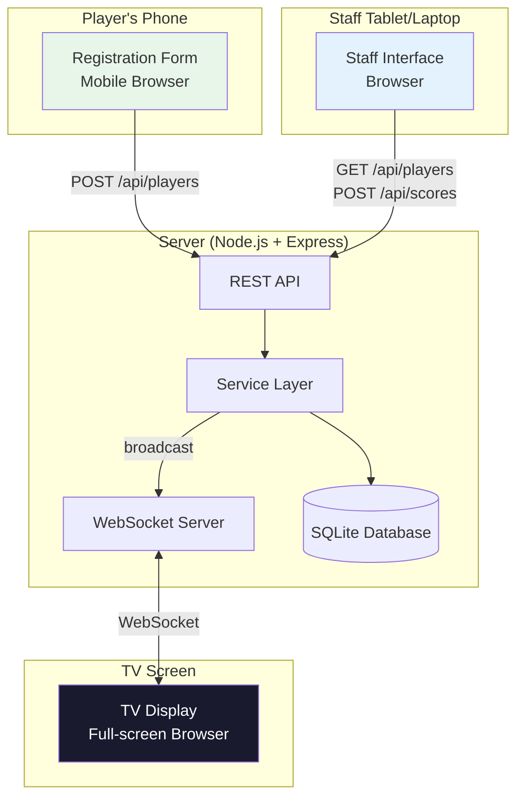
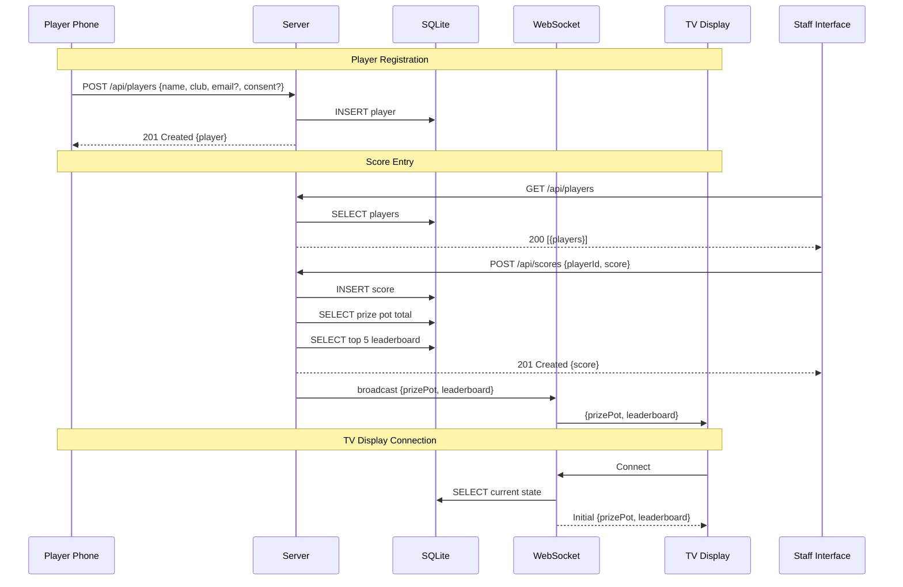

# Design Document: Event Scoreboard

## Overview

The Event Scoreboard is a real-time web application for physical hockey activations at live events. It consists of three interfaces served by a single Node.js server:

1. **Registration Form** — A mobile-optimized page opened by scanning a QR code at the event station. Players self-register with a display name, favourite club, and optional email (with GDPR-compliant consent).
2. **Staff Interface** — A tablet/laptop-optimized page for event staff to select registered players, enter scores, and confirm before saving.
3. **TV Display** — A 1920×1080 full-screen page shown on a large screen, displaying an animated prize pot and a top-5 leaderboard with animated transitions.

The server persists data to a SQLite database (file-based, zero-config), broadcasts updates to TV Display clients over WebSocket, and exposes a REST API for registration and score entry. The entire application is a single deployable Node.js process suitable for any cloud platform.

### Technology Choices

| Layer | Technology | Rationale |
|-------|-----------|-----------|
| Server runtime | Node.js + Express | Lightweight, widely supported on cloud platforms, good WebSocket ecosystem |
| WebSocket | ws (npm package) | Minimal, spec-compliant WebSocket server that integrates with Express |
| Database | SQLite via better-sqlite3 | Zero-config file-based persistence, no external database service needed, synchronous API simplifies server code |
| Frontend | Vanilla HTML/CSS/JS | Three simple pages with no complex state management; avoids framework overhead and build steps |
| Animations | CSS transitions + requestAnimationFrame | Native browser APIs for count-up and leaderboard animations; no animation library needed |
| QR Code | qrcode (npm package) | Server-side QR code generation as SVG/data URL |
| Language | TypeScript | Type safety for data models and API contracts |

### Key Design Decisions

- **Single server process**: All three interfaces are served as static pages from the same Express server. This simplifies deployment and eliminates CORS concerns.
- **SQLite over external DB**: For a single-event application, SQLite provides persistence without requiring a database service. The file can be backed up by copying a single file.
- **WebSocket for TV Display only**: Only the TV Display needs real-time push. The Staff Interface and Registration Form use standard HTTP requests.
- **Server-side QR generation**: The QR code is generated at server startup based on the configured base URL, avoiding client-side QR library dependencies.
- **No authentication**: Event staff access is controlled physically (staff have the tablet). The registration form is intentionally open to anyone with the QR code link.

## Architecture



### Request Flow



## Components and Interfaces

### REST API Endpoints

#### POST /api/players
Register a new player.

**Request Body:**
```json
{
  "displayName": "string (required, 1-50 chars)",
  "favouriteClub": "string (required, 1-100 chars)",
  "email": "string (optional, valid email format)",
  "emailConsent": "boolean (required if email provided)"
}
```

**Response 201:**
```json
{
  "id": "string (UUID)",
  "displayName": "string",
  "favouriteClub": "string",
  "createdAt": "string (ISO 8601)"
}
```

**Error 400:**
```json
{
  "error": "string",
  "fields": {
    "fieldName": "string (validation message)"
  }
}
```

#### GET /api/players
List all registered players (used by Staff Interface).

**Response 200:**
```json
{
  "players": [
    {
      "id": "string (UUID)",
      "displayName": "string",
      "favouriteClub": "string",
      "createdAt": "string (ISO 8601)"
    }
  ]
}
```

#### POST /api/scores
Record a score for a player (used by Staff Interface).

**Request Body:**
```json
{
  "playerId": "string (UUID, required)",
  "score": "number (required, positive integer)"
}
```

**Response 201:**
```json
{
  "id": "string (UUID)",
  "playerId": "string",
  "playerName": "string",
  "score": "number",
  "createdAt": "string (ISO 8601)"
}
```

**Error 400:**
```json
{
  "error": "string",
  "fields": {
    "fieldName": "string (validation message)"
  }
}
```

#### GET /api/scoreboard
Get current prize pot and leaderboard (used for initial TV Display state and fallback).

**Response 200:**
```json
{
  "prizePot": "number",
  "leaderboard": [
    {
      "rank": "number",
      "playerId": "string",
      "displayName": "string",
      "favouriteClub": "string",
      "score": "number"
    }
  ]
}
```

#### DELETE /api/players/:id
Delete a player's personal data (GDPR data deletion request).

**Response 204:** No content.

**Error 404:**
```json
{
  "error": "Player not found"
}
```

### WebSocket Protocol

The server maintains WebSocket connections with TV Display clients.

**Connection:** `ws://<host>/ws`

**Server → Client Messages:**

```json
{
  "type": "state",
  "data": {
    "prizePot": "number",
    "leaderboard": [
      {
        "rank": "number",
        "playerId": "string",
        "displayName": "string",
        "favouriteClub": "string",
        "score": "number"
      }
    ]
  }
}
```

The `state` message is sent:
- On initial connection (full current state)
- After each new score is saved (updated state)

**Client → Server Messages:**
No client-to-server messages are required. The TV Display is a passive receiver.

**Reconnection:** The TV Display client implements exponential backoff reconnection (1s, 2s, 4s, 8s, max 30s).

### Service Layer

The service layer encapsulates business logic and sits between the API/WebSocket handlers and the database.

```typescript
interface ScoreboardService {
  // Player operations
  registerPlayer(data: PlayerRegistration): Player;
  getPlayers(): Player[];
  deletePlayer(id: string): boolean;

  // Score operations
  recordScore(playerId: string, score: number): ScoreRecord;

  // Scoreboard state
  getScoreboardState(): ScoreboardState;
}
```

### Validation Module

A pure-function validation module handles input validation for both registration and score entry.

```typescript
interface ValidationResult {
  valid: boolean;
  errors: Record<string, string>;
}

function validatePlayerRegistration(data: unknown): ValidationResult;
function validateScoreEntry(data: unknown): ValidationResult;
```

Validation rules:
- `displayName`: required, 1–50 characters, trimmed
- `favouriteClub`: required, 1–100 characters, trimmed
- `email`: optional; if provided, must match standard email regex
- `emailConsent`: required and must be `true` if email is provided
- `playerId`: required, must be valid UUID format
- `score`: required, must be a positive integer (> 0)

### Frontend Components

#### Registration Form (`/register`)
- Mobile-optimized responsive layout
- Form fields: display name, favourite club, email (optional), consent checkbox
- Consent checkbox only visible when email field is non-empty
- Data retention notice and privacy explanation displayed below the form
- Client-side validation mirrors server-side rules
- Success confirmation screen after registration

#### Staff Interface (`/staff`)
- Player dropdown/search populated from GET /api/players
- Score input field (numeric)
- Confirmation screen overlay showing player name + score with Confirm/Cancel buttons
- Cancel returns to form with values preserved
- Success feedback after score is saved

#### TV Display (`/tv`)
- Full-screen 1920×1080 layout, dark background, high-contrast text
- Prize pot: large numeric display with count-up animation (using requestAnimationFrame to interpolate from old value to new value over ~1.5 seconds)
- Leaderboard: top 5 rows with rank, name, club, score; CSS transitions for position changes and new entries (slide-in animation)
- WebSocket connection with automatic reconnection
- No user interaction required

## Data Models

### Database Schema (SQLite)

```sql
CREATE TABLE players (
  id TEXT PRIMARY KEY,
  display_name TEXT NOT NULL,
  favourite_club TEXT NOT NULL,
  email TEXT,
  email_consent INTEGER DEFAULT 0,
  created_at TEXT NOT NULL DEFAULT (datetime('now'))
);

CREATE TABLE scores (
  id TEXT PRIMARY KEY,
  player_id TEXT NOT NULL,
  score INTEGER NOT NULL CHECK (score > 0),
  created_at TEXT NOT NULL DEFAULT (datetime('now')),
  FOREIGN KEY (player_id) REFERENCES players(id) ON DELETE CASCADE
);

CREATE INDEX idx_scores_player_id ON scores(player_id);
```

### TypeScript Types

```typescript
// Domain types
interface Player {
  id: string;
  displayName: string;
  favouriteClub: string;
  email?: string;
  emailConsent: boolean;
  createdAt: string;
}

interface PlayerRegistration {
  displayName: string;
  favouriteClub: string;
  email?: string;
  emailConsent?: boolean;
}

interface ScoreRecord {
  id: string;
  playerId: string;
  score: number;
  createdAt: string;
}

interface LeaderboardEntry {
  rank: number;
  playerId: string;
  displayName: string;
  favouriteClub: string;
  score: number;
}

interface ScoreboardState {
  prizePot: number;
  leaderboard: LeaderboardEntry[];
}

interface ValidationResult {
  valid: boolean;
  errors: Record<string, string>;
}
```

### Leaderboard Query

The leaderboard is computed by selecting the highest single score per player, ranked descending, limited to 5:

```sql
SELECT
  p.id AS player_id,
  p.display_name,
  p.favourite_club,
  MAX(s.score) AS score
FROM scores s
JOIN players p ON s.player_id = p.id
GROUP BY p.id
ORDER BY score DESC
LIMIT 5;
```

### Prize Pot Query

The prize pot is the sum of all scores:

```sql
SELECT COALESCE(SUM(score), 0) AS prize_pot FROM scores;
```


## Correctness Properties

*A property is a characteristic or behavior that should hold true across all valid executions of a system — essentially, a formal statement about what the system should do. Properties serve as the bridge between human-readable specifications and machine-verifiable correctness guarantees.*

### Property 1: Registration validation rejects missing required fields

*For any* registration input where one or more required fields (displayName, favouriteClub) are empty or whitespace-only, the validation function SHALL return an invalid result with error messages identifying exactly the missing fields.

**Validates: Requirements 1.7**

### Property 2: Registration validation rejects email without consent

*For any* registration input that includes a non-empty email address but has emailConsent set to false or undefined, the validation function SHALL return an invalid result with an error on the consent field.

**Validates: Requirements 1.8, 9.5**

### Property 3: Registration validation rejects invalid email formats

*For any* registration input that includes an email string not matching a valid email format, the validation function SHALL return an invalid result with an error on the email field.

**Validates: Requirements 1.9**

### Property 4: Valid registration creates a matching player record

*For any* valid registration input (non-empty displayName, non-empty favouriteClub, and either no email or email with consent), registering the player SHALL produce a Player record whose displayName and favouriteClub match the input.

**Validates: Requirements 1.10**

### Property 5: Score validation rejects non-positive values

*For any* score value that is not a positive integer (zero, negative numbers, non-integer numbers), the score validation function SHALL return an invalid result with an error on the score field.

**Validates: Requirements 2.6**

### Property 6: Leaderboard returns correct top N players in descending order

*For any* set of players with scores, the leaderboard SHALL contain at most 5 entries, each entry SHALL include the player's displayName, favouriteClub, and score, the entries SHALL be sorted in descending order by score, and the number of entries SHALL equal min(number of scored players, 5).

**Validates: Requirements 5.1, 5.2, 5.5**

### Property 7: Player and score data persistence round-trip

*For any* valid player registration and score entry, persisting the data to the database and then retrieving it SHALL produce records with values equal to the original input data.

**Validates: Requirements 7.1**

### Property 8: Player deletion removes all associated data

*For any* registered player, after deletion, the player SHALL no longer appear in the player list, and any scores associated with that player SHALL no longer be included in the prize pot total or leaderboard.

**Validates: Requirements 9.4**

## Error Handling

### Server-Side Errors

| Error Scenario | HTTP Status | Response | Recovery |
|---------------|-------------|----------|----------|
| Missing required registration fields | 400 | `{ error, fields }` with per-field messages | Client displays field-level errors |
| Invalid email format | 400 | `{ error, fields: { email: "..." } }` | Client highlights email field |
| Email without consent | 400 | `{ error, fields: { emailConsent: "..." } }` | Client highlights consent checkbox |
| Score without player selection | 400 | `{ error, fields: { playerId: "..." } }` | Client prompts player selection |
| Non-positive score value | 400 | `{ error, fields: { score: "..." } }` | Client highlights score field |
| Player not found (score entry) | 404 | `{ error: "Player not found" }` | Client refreshes player list |
| Player not found (deletion) | 404 | `{ error: "Player not found" }` | Client shows not-found message |
| Database error | 500 | `{ error: "Internal server error" }` | Logged server-side; client shows generic error |

### WebSocket Error Handling

| Error Scenario | Behavior |
|---------------|----------|
| Connection lost | TV Display reconnects with exponential backoff (1s → 2s → 4s → 8s → max 30s) |
| Server restart | TV Display reconnects; server sends full state on reconnection |
| Malformed message | Client ignores message and logs warning to console |
| Broadcast failure | Server logs error; does not crash; other clients unaffected |

### Client-Side Validation

All three interfaces perform client-side validation before submitting to the server:
- Registration Form: validates required fields, email format, consent requirement
- Staff Interface: validates player selection and positive score
- Server-side validation is always the authoritative check; client-side is for UX responsiveness

### Graceful Degradation

- If WebSocket is unavailable, the TV Display falls back to polling GET /api/scoreboard every 5 seconds
- If the database file is missing on startup, the server creates a new database with the schema
- If QR code generation fails, the server logs the error and serves the registration URL as plain text

## Testing Strategy

### Testing Framework

- **Test runner**: Vitest (fast, TypeScript-native, compatible with Node.js)
- **Property-based testing**: fast-check (mature PBT library for TypeScript/JavaScript)
- **HTTP testing**: supertest (for testing Express API endpoints)

### Unit Tests

Unit tests cover specific examples, edge cases, and error conditions:

- **Validation module**: Example-based tests for each validation rule (empty fields, valid inputs, boundary values)
- **Service layer**: Tests for registerPlayer, recordScore, getScoreboardState with concrete data
- **Leaderboard computation**: Edge cases — 0 players, exactly 5 players, tied scores, single player
- **Prize pot calculation**: Edge cases — no scores, single score, many scores
- **Player deletion**: Verify cascade deletion of scores

### Property-Based Tests

Property-based tests verify universal properties across generated inputs. Each test runs a minimum of 100 iterations.

| Property | Test Description | Tag |
|----------|-----------------|-----|
| Property 1 | Generate random registrations with missing required fields; verify validation rejects with correct field errors | Feature: event-scoreboard, Property 1: Registration validation rejects missing required fields |
| Property 2 | Generate random registrations with email but no consent; verify validation rejects with consent error | Feature: event-scoreboard, Property 2: Registration validation rejects email without consent |
| Property 3 | Generate random invalid email strings; verify validation rejects with email error | Feature: event-scoreboard, Property 3: Registration validation rejects invalid email formats |
| Property 4 | Generate random valid registrations; verify created player matches input | Feature: event-scoreboard, Property 4: Valid registration creates a matching player record |
| Property 5 | Generate random non-positive numbers; verify score validation rejects | Feature: event-scoreboard, Property 5: Score validation rejects non-positive values |
| Property 6 | Generate random sets of players with scores; verify leaderboard ordering, size, and data completeness | Feature: event-scoreboard, Property 6: Leaderboard returns correct top N players in descending order |
| Property 7 | Generate random players and scores; persist and retrieve; verify round-trip equality | Feature: event-scoreboard, Property 7: Player and score data persistence round-trip |
| Property 8 | Generate random players with scores; delete player; verify removal from all queries | Feature: event-scoreboard, Property 8: Player deletion removes all associated data |

### Integration Tests

Integration tests verify component interactions with 1–3 representative examples:

- **Registration → Staff Interface flow**: Register a player, verify they appear in GET /api/players
- **Score entry → WebSocket broadcast**: Save a score, verify connected WebSocket client receives updated state
- **WebSocket initial state**: Connect a client, verify it receives current prize pot and leaderboard
- **Server restart persistence**: Persist data, restart server, verify data is loaded and served correctly
- **GDPR deletion flow**: Register player, add scores, delete player, verify complete removal

### Smoke Tests

- Server starts and serves all three pages (/, /staff, /tv)
- QR code is generated and accessible
- Database is created on first startup
